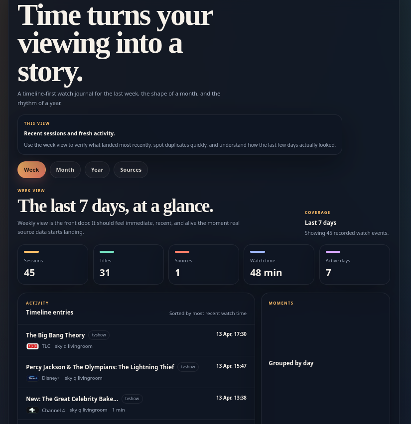

# Watch History

Watch history consumes the content you watch as you go to transform it into a unified timeline.

We all have that great content we enjoyed watching the, one that we absolutely want to recommend to friends and family,
  but with so many platforms and sources, it's not always easy to recall what the best of the best were.

Watch history aims to try to solve that, it collects your viewing data from sources it can talk to, it will then in future
  allow you to pick out the ones that are special that can go on to form a favourties/recommeds/watch again list.



## Documentation Role

`README.md` is the primary human-facing overview of the repository. As the project evolves, it should explain:
- how the project is structured
- what each major file or directory is for
- how to run or develop the application
- any important architectural conventions

## Current Structure

- `AGENTS.md`: Working project-definition document, collaboration guidance, engineering standards, and decision log.
- `app/`: Next.js App Router entrypoints, API routes, and global styles for the web application.
- `app/layout.tsx`: Root app shell wiring and shared page chrome entrypoint.
- `app/page.tsx`: Default route that forwards into the main timeline experience.
- `app/[view]/page.tsx`: Week, month, and year timeline route renderer.
- `app/analytics/page.tsx`: `/analytics` screen entrypoint for long-range watch, dataset, and import analytics.
- `app/favourites/page.tsx`: `/favourites` screen entrypoint for curated favourites and hidden-item recovery.
- `app/globals.css`: Global styling, theme tokens, and shared layout styles.
- `app/sources/page.tsx`: `/sources` screen entrypoint for source operations, sync, and retention controls.
- `app/api/curation/route.ts`: Curation update API endpoint for favourite and hide actions from timeline and favourites views.
- `app/sources/actions.ts`: Server actions for manual imports plus sync and retention settings updates.
- `app/api/health/route.ts`: Health-check endpoint for container and runtime verification.
- `app/api/sources/route.ts`: Source-status API endpoint used by the app and external checks.
- `app/api/sources/home-assistant/import/route.ts`: Manual and worker-triggered Home Assistant import endpoint.
- `app/api/sources/plex/import/route.ts`: Manual and worker-triggered Plex import endpoint.
- `app/api/timeline/[view]/route.ts`: Timeline data API for week, month, and year views.
- `components/`: UI components for the application shell, analytics, timeline views, and sources screens.
- `components/analytics-screen.tsx`: Analytics screen composition for overview cards, trend bars, ranked lists, source contribution, and import activity.
- `components/app-shell.tsx`: Shared navigation shell used across timeline and sources screens.
- `components/favourites-screen.tsx`: Favourites screen composition for curated summaries, filters, and hidden-item recovery.
- `components/source-list-screen.tsx`: Sources operations UI including health, sync, import, and retention forms.
- `components/timeline/event-card.tsx`: Interactive timeline row renderer with favourite and hide actions plus touch long-press support.
- `components/timeline-view-screen.tsx`: Main timeline view composition for summaries, groups, and entries.
- `components/timeline/channel-logo.tsx`: Compact channel-logo renderer for timeline entries.
- `components/timeline/empty-timeline-state.tsx`: Empty-state presentation when no watch history is available.
- `components/timeline/summary-cards.tsx`: Timeline summary and insight card rendering.
- `components/timeline/timeline-grid.tsx`: Timeline event/group grid for watch history rows.
- `configs/home-assistant-ca.crt.example`: Example placeholder for an optional Home Assistant CA certificate file when using a private CA.
- `configs/home-assistant.yaml.example`: Example non-secret Home Assistant source configuration for base URL, tracked entities, sync, and retention settings.
- `configs/plex.yaml.example`: Example non-secret Plex source configuration for sync and retention settings.
- `db/init/`: PostgreSQL initialization scripts for the first application schema.
- `db/init/001_initial.sql`: Initial schema for sources, import jobs, raw import records, media items, and watch events.
- `db/init/002_watch_event_curation.sql`: Initial schema extension for persistent watch-event curation.
- `docs/architecture/`: Feature specs, architecture notes, and implementation-shaping decisions that drive review-first development for each major slice of the product.
                        See [docs/architecture/README.md](docs/architecture/README.md): Index of architecture specs, their purpose, and the feature-by-feature map for this planning area.
- `lib/`: Server-side data access, formatting, and shared type definitions.
- `lib/app-config.ts`: App-level environment and timezone helpers.
- `lib/analytics.ts`: Server-side analytics queries for overview totals, watch-pattern rollups, dataset growth, and import activity.
- `lib/analytics-data.ts`: Pure analytics response-shaping helpers used for automated coverage without a live database.
- `lib/channels.ts`: Channel normalization and local logo-registry mapping for Sky Q channel branding.
- `lib/curation.ts`: Curation schema bootstrap, stable event-key logic, favourites queries, and favourite/hide updates.
- `lib/db.ts`: Shared PostgreSQL connection and query helpers.
- `lib/format.ts`: Formatting helpers used by timeline and source presentation code.
- `lib/home-assistant.ts`: Home Assistant connectivity and API request helpers.
- `lib/home-assistant-config.ts`: Home Assistant YAML config loader/writer for sync and retention settings.
- `lib/home-assistant-import.ts`: Home Assistant raw import and watch-event rebuilding from persisted state history.
- `lib/home-assistant-normalization.ts`: Pure Home Assistant history normalization helpers used by automated coverage and importer shaping.
- `lib/plex.ts`: Plex connectivity and API helpers for token-based server access.
- `lib/plex-config.ts`: Plex non-secret scheduled sync configuration loader/writer.
- `lib/plex-import.ts`: Plex raw history import and watch-event normalization from persisted raw Plex records, with current `/status/sessions` playback shown as provisional in-progress entries when relevant.
- `lib/plex-normalization.ts`: Pure Plex history and session normalization helpers used by automated coverage and importer shaping.
- `lib/source-locks.ts`: Shared advisory-lock keys for per-source import and cleanup coordination.
- `lib/source-retention.ts`: Retention config parsing, summaries, and per-source cleanup execution.
- `lib/source-status.ts`: Pure source-health and operational-status helpers extracted for container-first automated test coverage.
- `lib/sources.ts`: Source registry, status derivation, and `/sources` screen data assembly.
- `lib/timeline-data.ts`: Pure timeline view mapping and summary helpers extracted for automated coverage and future reuse.
- `lib/timeline.ts`: Timeline query and grouping logic for week, month, and year views.
- `lib/types.ts`: Shared application types for timeline, analytics, and source status data.
- `public/channel-logos/`: Curated local SVG channel logo assets for recognized channels.
- `public/static/watch-history-main.png`: Main README screenshot of the current app.
- `scripts/source-sync-worker.ts`: Scheduled source sync worker for Docker Compose, currently handling Home Assistant and Plex.
- `tests/`: `vitest` suites for pure server-side helpers plus mocked server-side orchestration coverage such as source status assembly, importer rebuilding, and source-retention cleanup.
- `Dockerfile`: Canonical application container definition for local development.
- `docker-compose.yml`: Container orchestration for the web application and PostgreSQL database.
- `next.config.ts`: Next.js runtime configuration.
- `package.json`: App package manifest, scripts, and dependency declarations.
- `tsconfig.json`: TypeScript compiler configuration.
- `vitest.config.ts`: Base `vitest` configuration, path aliases, and coverage reporters.
- `.env.example`: Required environment variables for the Docker Compose environment.
- `README.md`: Repository overview and high-level documentation index.

## Feature Workflow

Feature work in this repository follows a spec-first workflow:
- start by creating or updating a feature spec under `docs/architecture/<feature-name>.md`
- review that spec with the user before implementation
- capture open questions and gather real source data where needed before locking the design
- update `AGENTS.md`, `README.md`, and any other relevant docs when the feature scope or status becomes clearer
- ask the user whether they want a feature branch created before implementation starts
- if a branch is created, name it from the feature name without the `.md` suffix
- if the local Docker Compose stack is not already running, ask the user before starting it because their active environment may be a remote Docker host
- review `README.md` at the end of the feature and update it where needed to mark the feature complete and document any new files, changed responsibilities, or workflow changes
- once the feature is complete, ask whether the user wants the branch pushed and whether they want a PR raised
- if a PR is raised, title it from the feature or branch name by replacing hyphens with spaces and capitalizing each word, then use a short description that explains what the feature achieves

## Current Status

The current application is a working first version:
- Next.js provides the web app and server-side routes
- PostgreSQL stores sources, import jobs, raw records, and normalized watch events
- week, month, and year timeline views are live
- Home Assistant authentication and Sky Q history import are working
- Plex source registration, connectivity checks, manual history import, and scheduled sync are available
- Plex imports rebuild durable timeline history from persisted raw Plex rows, while active sessions remain provisional in-progress entries
- per-source retention settings are available on `/sources` for durable history, import-job audit rows, and Plex provisional session data
- a dedicated analytics tab now summarizes long-range watch patterns, dataset growth, source contribution, and recent import activity
- a dedicated favourites tab now persists favourite and hidden-item curation on top of imported watch history
- scheduled sync is available through Docker Compose
- the UI uses live imported data rather than mocked watch-history content
- `/sources` is a user-facing operations screen with source health, sync cadence, and import-state summaries
- the worker now also applies per-source retention cleanup inside Docker Compose when a source is set to windowed retention

Current planning is organized as feature-specific architecture documents under `docs/architecture`.


## Progress And TODO

Completed:
- Feature 1: Docker-first app scaffold with week, month, and year views
- Feature 2: Home Assistant authentication and connectivity
- Feature 3: Sky Q history import from Home Assistant entities
- Feature 4: Timeline summaries, analytics, and improved activity overview
- Feature 5: Scheduled Home Assistant sync with editable interval and overlap protection
- Feature 6: Channel and platform branding with a curated local registry and timeline-row rendering
- Feature 7: Plex source support with env-based connectivity, manual history import, active-session enrichment, and scheduled sync
- Feature 8: Import reliability and source-health visibility with degraded source status, a shared warning banner, and clearer `/sources` recovery state
- Feature 9: Home Assistant current-playing continuity with watch-event rebuilding from persisted raw history so same-channel Sky Q programme transitions survive repeated imports
- Feature 10: Plex continuity and `/sources` polish with persisted-raw Plex normalization, provisional active-session timeline cues, and operational source summaries
- Feature 11: source data-retention controls with YAML-backed source settings, `/sources` editing, worker cleanup, and safe retention of import-job audit rows
- Feature 12: analytics tab for overview, watch patterns, dataset growth, source contribution, and import activity from real stored data
- Feature 13: favourites tab with persistent favourite and hide curation, hidden-item exclusion from default timeline and analytics views, and recovery of hidden items from `/favourites`
- Feature 14: container-first local automated testing with `vitest`, coverage output, helper-focused tests, mocked source, importer, retention, and analytics orchestration coverage, and documented TDD guidance

Recommended next pickup:
1. Pick up Feature 15 for CI or GitHub Actions once the local container-first test workflow is stable enough to enforce remotely
2. Resume any remaining DB-backed coverage work for Feature 14 only if you want to broaden beyond the current non-DB importer and retention slices
3. Decide whether streak and time-of-day metrics belong in a Feature 12 follow-up pass or a later feature

## Development Workflow

The supported development workflow runs inside Docker.

The repository `docker-compose.yml` is the canonical local deployment definition for the application stack. In some sessions, however, the live application and data may be running on a remote Docker server instead of the local machine. If the local stack is not already running, do not assume it should be started automatically; confirm with the user first and use remote user-provided command output when that remote environment is the active source of truth.

1. Create `.env` from `.env.example`.
2. Create `configs/home-assistant.yaml` from `configs/home-assistant.yaml.example`.
3. Add your Home Assistant token to `.env`.
4. Start the stack with `docker compose up --build`.
5. Open `http://localhost:3000`.

Do not run the application stack directly on the host machine. Docker and `docker compose` are the intended execution environment.

## Automated Testing

Feature 14 introduces the first container-first automated test workflow.

Canonical commands:
- `docker compose exec web npm run test`
- `docker compose exec web npm run test:watch`
- `docker compose exec web npm run typecheck`

`npm run test` runs `vitest` in coverage mode and should finish with a text coverage summary while also writing the HTML report under `coverage/`.

Current test scope:
- pure server-side helpers such as formatting, source retention, source-status derivation, timeline shaping, analytics response mapping, and importer normalization
- mocked server-side orchestration coverage for source status assembly, shared health notices, and analytics query shaping
- no browser automation yet
- no mandatory coverage threshold yet

TDD guidance for contributors:
- prefer writing a failing or focused test first when adding logic-heavy behavior
- if true test-first is not practical, add or update tests in the same change as the protected code
- start with pure helpers and extracted server logic before widening into DB-backed or UI-heavy coverage

If dependencies change, rebuild the Docker image before running tests so the containerized toolchain stays in sync with `package.json`.

## Environment Variables

These variables are required by the Compose environment:
- `POSTGRES_DB`
- `POSTGRES_USER`
- `POSTGRES_PASSWORD`
- `DATABASE_URL`
- `APP_URL`
- `APP_INTERNAL_URL`
- `APP_TIMEZONE`

These variables are reserved for the Home Assistant integration flow:
- `HOME_ASSISTANT_ACCESS_TOKEN`

These variables are reserved for the planned Plex integration flow:
- `PLEX_BASE_URL`
- `PLEX_TOKEN`

`DATABASE_URL` should be derived from the Postgres settings, for example:

```env
DATABASE_URL=postgresql://${POSTGRES_USER}:${POSTGRES_PASSWORD}@db:5432/${POSTGRES_DB}
```

Secrets for future external integrations should follow the same pattern: define variable names in documentation, provide real values through the env file, and inject them into the Docker Compose environment.

Repository workflow note:
- agents should not inspect `.env`, `.env.*`, or similar secret-bearing files unless the user explicitly asks for that in the current task
- when secret-backed behavior needs validation, prefer user-run commands, sanitized outputs, or explicit user-provided values over direct secret-file inspection

For Home Assistant, the current plan is to keep the non-secret base URL and tracked entity IDs in YAML, and supply the long-lived access token through the env file so the application can authenticate server-side and query entity history through the supported APIs.

`APP_TIMEZONE` controls how timestamps are rendered and how timeline groupings are labeled in the application. For a UK deployment, use:

```env
APP_TIMEZONE=Europe/London
```

`APP_INTERNAL_URL` is used by the scheduled sync worker to call the app from inside Docker Compose. The default is:

```env
APP_INTERNAL_URL=http://web:3000
```

## Home Assistant Import

The first Sky Q ingestion path is manual from the `/sources` page.

When you trigger the import, the app:
- calls Home Assistant's `/api/history/period/<timestamp>` endpoint for the configured entities
- supplements the historical data with the current entity state when needed
- preserves raw state-history records in `raw_import_records`
- rebuilds normalized Sky Q watch sessions into `watch_events` from the persisted raw Home Assistant records already stored for the configured entities
- makes those events available in the week, month, and year views

The current import window is the last 365 days.
Repeated imports are intended to be idempotent at the normalized timeline layer: raw source records are upserted, and Home Assistant-derived watch events are rebuilt from persisted raw history instead of blindly appended or limited to only the latest fetched response.
Manual and scheduled imports are protected against overlap so the same source cannot be imported twice at the same time.

Normalization notes:
- generic device-only rows such as `Sky Q Bedroom` or `Sky Q Livingroom` are filtered out unless Home Assistant exposes meaningful programme metadata
- real timeline entries preserve channel/source context and device context separately
- current entity state is merged into import processing so currently playing content can appear even when history has not yet emitted a fresh transition
- persisted raw Home Assistant history is now the normalization source of truth, so earlier programme segments survive later imports even when a newer fetch is less complete than the previously captured raw data
- recognized channels now persist a high-confidence `metadata.channel_key` when matched by the local registry, while unknown channels remain text-only

## Scheduled Sync

Source sync can also run automatically inside Docker Compose.

- the `worker` service reads `configs/home-assistant.yaml` and `configs/plex.yaml`
- it checks each source's `sync.enabled` and `sync.interval_minutes`
- when enabled, it triggers the same import path used by the manual import button
- repeated scheduled imports are intended to remain idempotent
- scheduled and manual imports share the same overlap protection for each source

You can manage the sync interval from the `/sources` page, and the setting is written back to the relevant source config file.
The `/sources` page also shows the current status, saved interval, and next automatic run for each source.

## Home Assistant Configuration

Home Assistant uses two configuration surfaces:
- secrets go in `.env`
- non-secret source settings go in `configs/home-assistant.yaml`

Example `configs/home-assistant.yaml`:

```yaml
base_url: "http://homeassistant.local:8123"
entities:
  - "media_player.sky_q_livingroom"
  - "media_player.sky_q_bedroom"
sync:
  enabled: false
  interval_minutes: 30
retention:
  mode: indefinite
```

`base_url` is intentionally stored in YAML because it is not sensitive. The access token must stay in `.env`.
The `sync` section is also non-sensitive and controls the scheduled Home Assistant import worker.

Plex follows a similar split:
- secrets and connection details go in `.env`
- non-secret scheduled sync settings go in `configs/plex.yaml`

Example `configs/plex.yaml`:

```yaml
sync:
  enabled: false
  interval_minutes: 30
retention:
  mode: indefinite
```

`PLEX_BASE_URL` and `PLEX_TOKEN` stay in `.env`, while the Plex worker schedule stays in `configs/plex.yaml`.

Retention notes:
- `retention.mode: indefinite` keeps durable source history, import-job audit rows, and any source-specific provisional rows until normal source updates replace them
- `retention.mode: windowed` enables cleanup inside the worker
- `history_days` controls how long durable `raw_import_records` and durable `watch_events` are kept for that source
- `import_job_days` controls how long unreferenced `import_jobs` rows are kept
- `provisional_hours` applies to Plex provisional session rows only

Example windowed Plex retention:

```yaml
sync:
  enabled: true
  interval_minutes: 30
retention:
  mode: windowed
  history_days: 365
  import_job_days: 90
  provisional_hours: 24
```

If your Home Assistant instance uses a certificate signed by a private or self-signed CA, also copy `configs/home-assistant-ca.crt.example` to `configs/home-assistant-ca.crt` and paste the PEM-encoded CA certificate there. The app will use that CA file when calling Home Assistant without disabling TLS verification.

## How To Get A Home Assistant Token

Use a long-lived access token from your Home Assistant profile.

1. Sign in to Home Assistant in your browser.
2. Open your profile page.
3. Scroll to `Long-Lived Access Tokens`.
4. Create a new token and copy it immediately.
5. Put that value in `.env` as `HOME_ASSISTANT_ACCESS_TOKEN`.

The official Home Assistant REST API docs describe this token flow and the required bearer-token header:
- https://developers.home-assistant.io/docs/api/rest

## How To Get A Plex Token

The current Plex integration uses an `X-Plex-Token` supplied through `.env`.

Based on Plex's support guidance, the practical retrieval flow is:

1. Sign in to Plex Web App in your browser.
2. Open a library item.
3. Open that item's XML view.
4. Look in the URL for the `X-Plex-Token` query parameter.
5. Copy the token value into `.env` as `PLEX_TOKEN`.

You will also need the base URL for your Plex Media Server, which should be stored as `PLEX_BASE_URL`.

Official references:
- https://support.plex.tv/articles/204059436-finding-an-authentication-token-x-plex-token/
- https://support.plex.tv/articles/201638786-plex-media-server-url-commands/

## Home Assistant Source Files

- `configs/home-assistant-ca.crt.example` is the committed example for an optional CA certificate.
- `configs/home-assistant-ca.crt` is the real local CA file and is ignored by git.
- `configs/home-assistant.yaml.example` is the committed example file.
- `configs/home-assistant.yaml` is the real local config file and is ignored by git.
- `configs/plex.yaml.example` is the committed example file for Plex scheduled sync.
- `configs/plex.yaml` is the real local Plex sync config file and is ignored by git.
- `.env.example` documents the token variable name, but real tokens must only live in your local `.env`.

## Useful Validation

To validate the running application:

1. Open `/sources`
2. Confirm Home Assistant is connected
3. Trigger a manual import or wait for the next scheduled run
4. Confirm `Latest import` updates
5. Check `/week` for fresh timeline entries and durations

To validate scheduled sync behavior:

```bash
docker compose logs -f worker
```

The worker logs:
- startup
- skipped ticks and why for each source
- scheduled sync triggers
- scheduled sync completion
